# Off-Road Semantic Segmentation — U-Net with a ResNet34 Encoder

Pixel-wise semantic segmentation of off-road driving scenes into 9 classes (trails, grass, vegetation, puddles, obstacles, sky) with a **U-Net + ImageNet-pretrained ResNet34** encoder, trained in **four progressive phases** under a strict GPU-memory budget (≤ 5 GB for training, ≤ 4 GB for inference on Google Colab).


> **Where the numbers come from.** The training notebook was saved without its outputs. The published code is the final consolidated version of the notebook, with a few bugs fixed after submission (see [Fixed after submission](#fixed-after-submission)). It is not the exact code of the run that produced the results, and **it has not been re-run on a GPU**. All training results below come from the **project report** (curves and one screenshot of the last training epoch) and are labelled with their source. The dataset split and class statistics were **re-computed** from the data with the notebook's own code and match the report exactly. See [Results](#results).

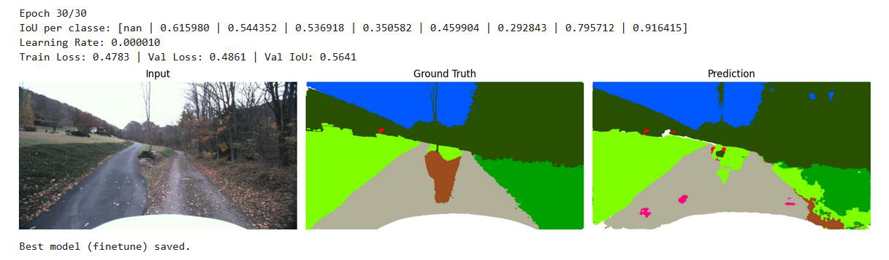

*Last epoch of the final training phase (screenshot from the project report): per-class validation IoU, validation mIoU 0.5641, and the prediction on a validation image.*

---

## Overview

| | |
|---|---|
| **Task** | Semantic segmentation — one of 9 labels for every pixel of a 1024 × 544 RGB image |
| **Data** | 743 images (after manual cleaning) from the training split of the [Yamaha-CMU Off-Road Dataset](https://theairlab.org/yamaha-offroad-dataset/) |
| **Model** | U-Net, ResNet34 encoder pretrained on ImageNet ([segmentation_models_pytorch](https://github.com/qubvel-org/segmentation_models.pytorch)) |
| **Training** | 4 phases: frozen encoder → partial encoder fine-tuning, alternating a weighted focal loss and a CE + Dice loss |
| **Best validation mIoU** | **0.5641** (8 classes, background excluded) |
| **Context** | Group project, Machine Learning course, University of Salerno, A.Y. 2024/25 |

The project was a course assignment with a fixed setup. The instructors provided:
- the dataset;
- a notebook template in which each group implements `load_model()` and `predict()`;
- an evaluation loop marked *"DO NOT MODIFY"*, used to score every submission on a **private test set**.

The rules were:
- use only the provided images (no external data); on-the-fly augmentation was allowed;
- run everything on Google Colab;
- stay below **5 GB of GPU memory during training** and **4 GB during testing**.

---

## Dataset

### Source and license

The images are a subset of the **Yamaha-CMU Off-Road Dataset (YCOR)**, published by the AirLab at Carnegie Mellon University under the [Creative Commons Attribution 4.0 International License](https://creativecommons.org/licenses/by/4.0/).

- Dataset page and download: <https://theairlab.org/yamaha-offroad-dataset/>
- Paper: D. Maturana, P.-W. Chou, M. Uenoyama, S. Scherer, *Real-time Semantic Mapping for Autonomous Off-Road Navigation*, Field and Service Robotics, 2018 ([PDF](https://www.ri.cmu.edu/app/uploads/2017/11/semantic-mapping-offroad-nav-compressed.pdf))

**The dataset is not included in this repository.** The images reproduced in `assets/` are YCOR images and are shared under the same CC BY 4.0 license.

The course distributed the 931 images of the YCOR training split in its own format:
- one folder per sample, renumbered (`0002/`, `0004/`, …);
- each folder holds `rgb.jpg` and `labels.png`;
- the masks are palette PNGs whose pixel values are the class indices 0–8.

### Classes

Pixel share and image counts are computed from the 743 cleaned masks (`labels.png`) with the notebook's `compute_class_distribution` function.

| Index | Class | Mask colour (RGB) | Pixels | Images containing it |
|:-:|---|---|--:|--:|
| 0 | background | 255, 255, 255 | 2.94% | 743 |
| 1 | smooth trail | 178, 176, 153 | 16.13% | 402 |
| 2 | traversable grass | 128, 255, 0 | 13.36% | 487 |
| 3 | rough trail | 156, 76, 30 | 16.60% | 456 |
| 4 | puddle | 255, 0, 128 | **0.12%** | **32** |
| 5 | obstacle | 255, 0, 0 | **0.67%** | 139 |
| 6 | non-traversable low vegetation | 0, 160, 0 | 7.17% | 321 |
| 7 | high vegetation | 40, 80, 0 | 32.68% | 737 |
| 8 | sky | 1, 88, 255 | 10.33% | 668 |

Puddles and obstacles together cover less than 1% of the pixels. Most of the training strategy deals with this imbalance.

### Manual cleaning: 931 → 743 images

Visual inspection showed many masks that did not match their image:
- puddles and obstacles labelled where there are none;
- near-identical frames labelled inconsistently, especially *smooth* vs. *rough trail*.

Samples with wrong masks were removed by hand, which left **743 images**.

A second, stricter cleaning pass (566 images) made the model overfit and was abandoned.

<p align="center">
  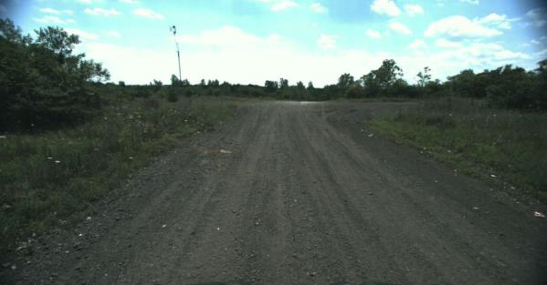
  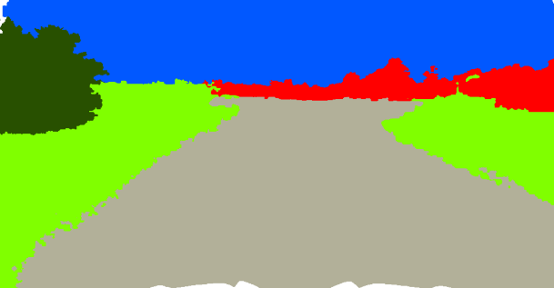
</p>

*A sample removed during cleaning: image and mask (figure from the project report, p. 7).*

The list of retained samples is not published. The cleaning cannot be reproduced exactly from the public YCOR release.

### Split

A two-stage **multilabel stratified split** (`MultilabelStratifiedShuffleSplit`, seed 69) keeps every class present in each subset. A random split could leave the rarest class out of validation or test altogether.

| Split | Images | Images with a puddle | Images with an obstacle |
|---|--:|--:|--:|
| Train | 531 | 23 | 100 |
| Validation | 133 | 6 | 25 |
| Test | 79 | 3 | 14 |

These sizes come from re-running the notebook's split function on the 743 images. The per-split class distributions match the three histograms in the project report. The report's curves were therefore produced on this exact split.

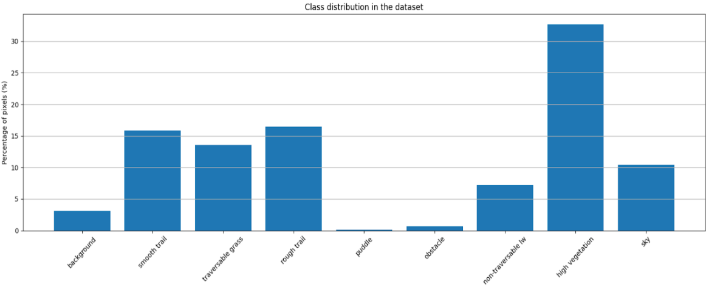

---

## Model

- **Architecture**: `smp.Unet(encoder_name="resnet34", encoder_weights="imagenet", classes=9)`. The decoder uses skip connections to recover spatial detail, and the output is a `(B, 9, H, W)` logit map.
- **Why this architecture**: U-Net is a standard choice for pixel-wise tasks. A ResNet34 encoder brings ImageNet features to a dataset of only a few hundred images while keeping memory well within the 5 GB budget.
- **Input**:
  - images resized to 544 × 1024 (their native size);
  - normalized with ImageNet mean and standard deviation, chosen after comparing them with the dataset's own statistics.
- **Augmentation** (Albumentations, applied on the fly to the training set only):
  - horizontal and vertical flip;
  - shift, scale and rotate;
  - elastic transform;
  - brightness and contrast, colour jitter, hue and saturation;
  - Gaussian blur.

---

## Training procedure

Each phase starts from the best checkpoint of the previous one. Common settings for all phases:
- batch size 4;
- AdamW;
- `ReduceLROnPlateau` scheduler on the validation mIoU;
- early stopping on the validation mIoU;
- seed 69 for the split, Python, NumPy and PyTorch;
- class weights for the weighted losses: inverse pixel frequency on the training split, capped at 20, normalized to mean 1.

| Phase | Trainable parts | Loss | Learning rate(s) | Why |
|---|---|---|---|---|
| **1** | decoder blocks 1–4 + segmentation head (encoder frozen) | weighted focal loss, γ = 3 | 1e-3 | Push the model towards the rare, hard classes from the start |
| **2** | same as phase 1 | 0.5 · weighted CE + 0.5 · Dice | 3e-4 | Recover overall quality on the frequent classes; Dice rewards region overlap |
| **3** | + encoder `layer2`–`layer4` | weighted focal loss, γ = 3 | encoder 1e-5 · decoder 1e-4 · head 1e-4 | Adapt the ImageNet features to off-road scenes without overwriting them |
| **4** | same as phase 3 | CE + Dice | encoder 1e-6 · decoder 1e-5 · head 5e-5 | Final low-learning-rate refinement |

The learning rates are those in the published notebook. The report and the slides give slightly different values for phases 3 and 4. A screenshot in the report shows a phase-3 configuration with encoder 1e-6, decoder 1e-5 and head 1e-4. The exact values of the run behind the curves are therefore uncertain (details in [`docs/DEVLOG.md`](docs/DEVLOG.md)).

**Memory budget.** According to the report, peak GPU memory on Colab was:
- **3.8 GB** with the encoder frozen (phases 1–2);
- **4.7 GB** with three encoder stages unfrozen (phases 3–4).

Both are below the 5 GB limit. Freezing the encoder was a regularization choice and a way to fit the memory budget.

---

## Results

### Where each number comes from

| Result | Source |
|---|---|
| Split sizes, class statistics | **Re-computed** from the data with the notebook's code |
| Final validation mIoU 0.5641 and per-class IoU | Screenshot of the last epoch's printed output (report, p. 21) |
| Validation mIoU at the end of phases 1–3 | **Read from the curves** in the report (approximate) |
| Test mIoU ≈ 0.5, inference time, GPU memory | **Report text only.** The corresponding notebook outputs were not preserved |

### Validation mIoU across the four phases

| Phase | Epochs run | Validation mIoU at the end of the phase |
|---|--:|---|
| 1 — focal loss, frozen encoder | 30 | ≈ 0.43 (read from plot) |
| 2 — CE + Dice, frozen encoder | 48 (early stopping) | ≈ 0.48 (read from plot) |
| 3 — focal loss, encoder partly unfrozen | 20 | ≈ 0.53 (read from plot) |
| 4 — CE + Dice, encoder partly unfrozen | 30 | **0.5641** (printed output) |

### Per-class validation IoU after phase 4

| Class | IoU | Pixel share |
|---|--:|--:|
| sky | 0.916 | 10.33% |
| high vegetation | 0.796 | 32.68% |
| smooth trail | 0.616 | 16.13% |
| traversable grass | 0.544 | 13.36% |
| rough trail | 0.537 | 16.60% |
| obstacle | 0.460 | 0.67% |
| puddle | 0.351 | 0.12% |
| non-traversable low vegetation | 0.293 | 7.17% |
| **mean (mIoU)** | **0.5641** | |

The mean of the eight printed values is 0.5641, the same as the printed mIoU. Background is excluded from the metric.

How the rare classes evolved, read from the per-class curves:
- **obstacle** went from IoU 0 to about 0.3 during phase 1;
- **puddle** stayed at 0 throughout phases 1 and 2, and only started to be detected in phase 3, when the encoder was partly unfrozen and the focal loss was used again;
- **non-traversable low vegetation** is the weakest class, even though it covers 7% of the pixels. It is easily confused with traversable grass and high vegetation, and the labels themselves are ambiguous.

### Test set

The report states a test mIoU of about **0.5** on the 79-image test split, against 0.56 on validation. The output of that cell was not saved, so the value cannot be checked and there is no per-class breakdown. Only 3 test images contain a puddle, so any per-class test IoU for puddles would be very noisy.

The report also gives an inference time of **3.5 s**. The measuring function (`measure_inference_time`) returns the **total** time over the test loader. This is most likely the time for the whole 79-image test split on a Colab GPU, not the time per image.

### Training curves

| | Loss | Validation mIoU | Validation IoU per class |
|---|---|---|---|
| Phase 1 | 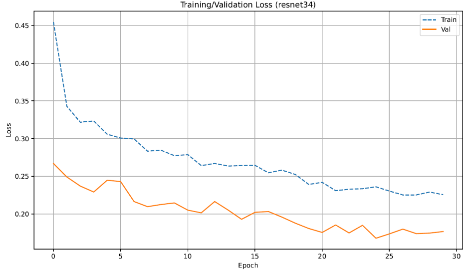 | 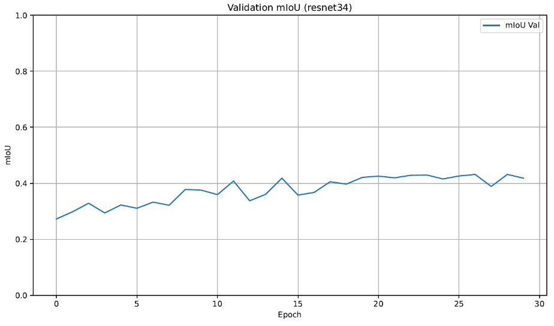 | 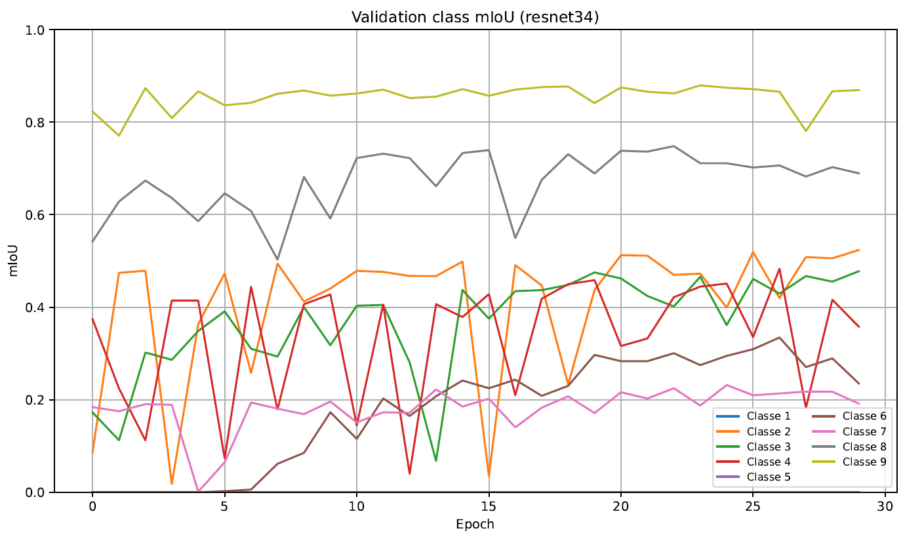 |
| Phase 2 | 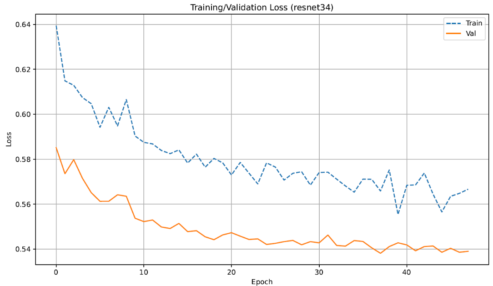 | 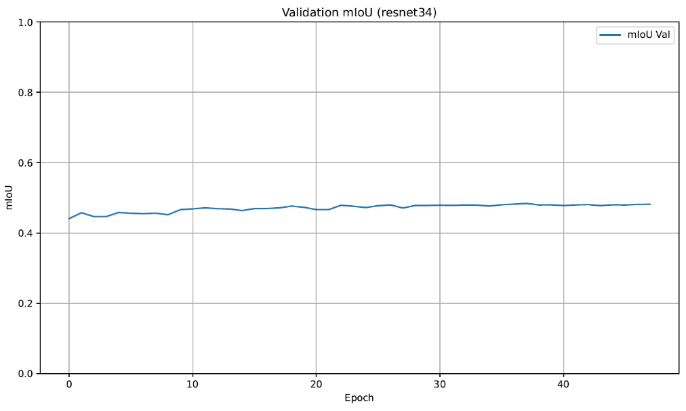 | 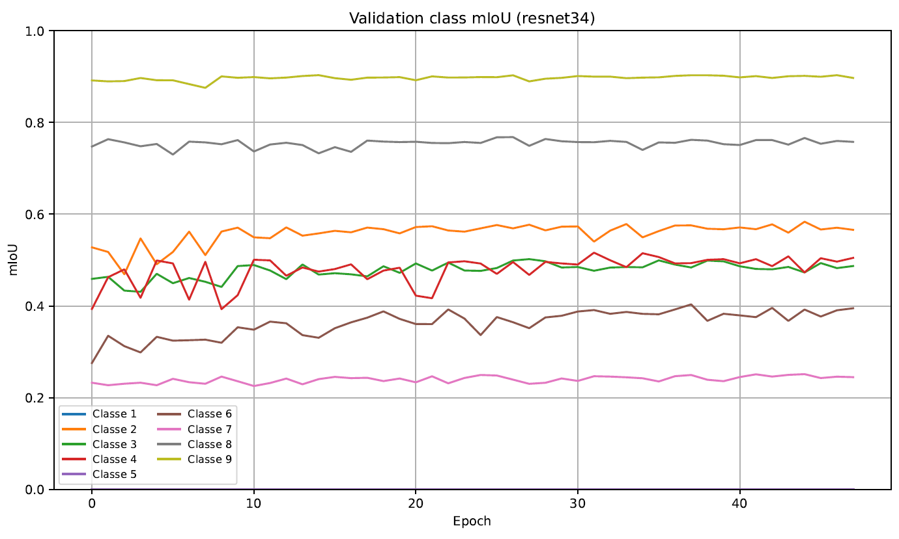 |
| Phase 3 | 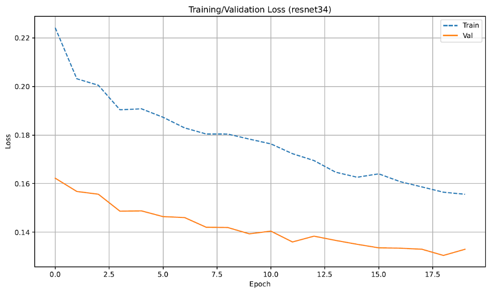 | 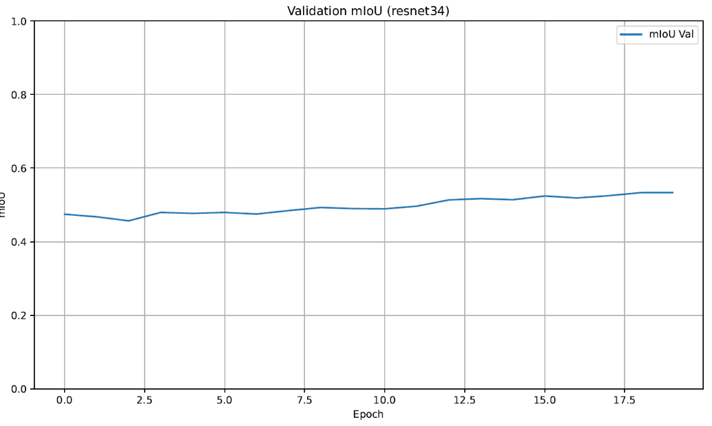 | 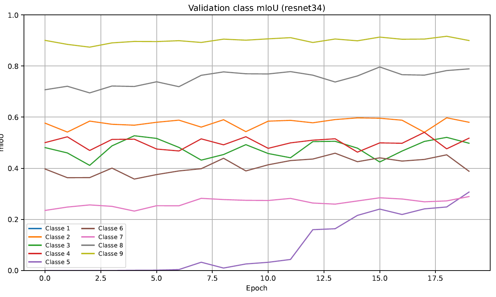 |
| Phase 4 | 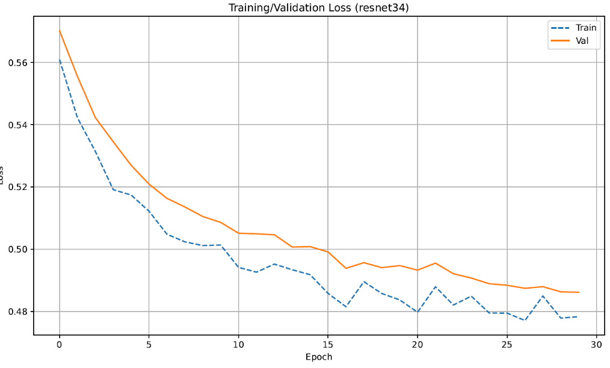 | 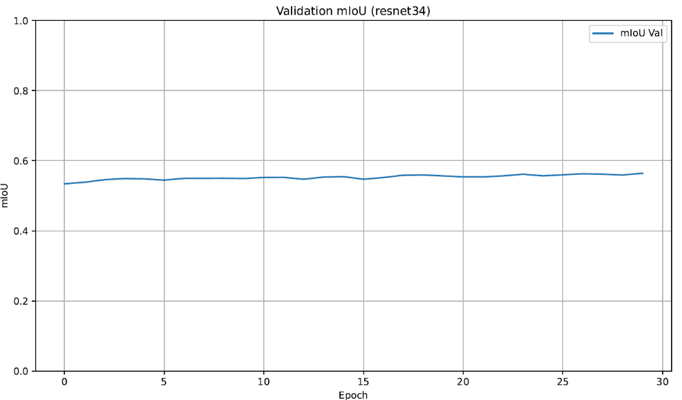 | 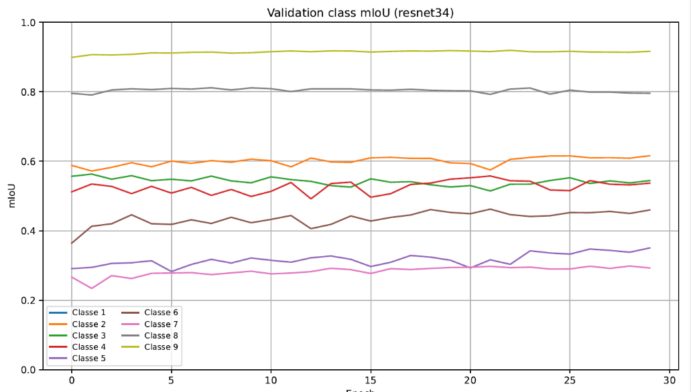 |

How to read the plots:
- **In these figures the legend is shifted by one** (fixed in the published code, which now labels the curves with the class names). "Classe 1" is the background, which is never plotted because its IoU is excluded (NaN). "Classe 2" … "Classe 9" are class indices 1 … 8: smooth trail, traversable grass, rough trail, puddle, obstacle, non-traversable low vegetation, high vegetation, sky.
- The training loss is often **above** the validation loss. This is expected: training images are augmented and validation images are not.
- Losses of different phases are not comparable, because phases 1/3 and 2/4 use different loss functions.

### A note on the metric

The notebook's `validate` function computes a **dataset-level IoU**: intersections and unions are summed over all validation images before dividing. The course's evaluation loop instead computes the IoU **per image** and averages it, ignoring classes absent from an image. The two numbers are not interchangeable: 0.5641 is not the course's competition score. The score on the instructors' private test set is not part of this repository.

---

## Repository structure

```
offroad-semantic-segmentation-unet/
├── notebooks/
│   ├── train.ipynb      # data loading, split, augmentation, model, 4 training phases, test evaluation
│   └── evaluate.ipynb   # course template: load_model() + predict(), and the instructors' evaluation loop
├── assets/              # figures taken from the project report
├── docs/
│   └── DEVLOG.md        # how the repository was prepared, sources of every figure, discrepancies
├── requirements.txt
├── LICENSE
└── README.md
```

What changed compared with the submitted notebooks:
- `train.ipynb`: the bugs listed in [Fixed after submission](#fixed-after-submission), configurable paths, seeds, and Kaggle and Colab metadata removed. Architecture, losses, phases and hyperparameters are unchanged.
- `evaluate.ipynb`: code unchanged. Only the outputs of an interrupted sanity-check run and the Colab metadata were removed.

Every change is documented, with its reason, in [`docs/DEVLOG.md`](docs/DEVLOG.md).

---

## How to run

The notebooks were written for **Google Colab with a GPU runtime** and read and write Google Drive.

### 1. Get the data

1. Download the Yamaha-CMU Off-Road Dataset from the [AirLab page](https://theairlab.org/yamaha-offroad-dataset/) and use its **training split** (931 images).
2. Arrange it as one folder per sample, each containing `rgb.jpg` and `labels.png`.
3. Make sure that `labels.png` stores the **class index** (0–8) of each pixel. If your copy stores RGB colours, convert each colour to its index using the table in [Classes](#classes).
4. Optionally remove mislabeled samples, as described above. The exact list of the 743 samples is not published, so your split will differ from the one in the report.

### 2. Put the data where the notebook expects it

All paths derive from `PROJECT_ROOT`, set in cell 3. By default it points to Google Drive:

```
<PROJECT_ROOT>/                     default: /content/drive/MyDrive/ML_Project_Work
├── train/archive/train/<sample_id>/rgb.jpg       ← DATA_ROOT
├── train/archive/train/<sample_id>/labels.png
└── modelstages/                    ← CHECKPOINT_DIR, created automatically
```

To use another folder, set the `PROJECT_ROOT` environment variable or edit the default in cell 3. Outside Colab, the Drive-mount cell does nothing.

### 3. Train (regenerates the model)

Open `notebooks/train.ipynb` in Colab with a GPU runtime and run the cells in order.

Each phase saves its best checkpoint to `modelstages/`: `FirstStageModel.pth` … `FourthStageModel.pth`. Each phase also writes its curves to `training_curves_phase1.pdf` … `training_curves_phase4.pdf`. The final model is `FourthStageModel.pth`. The last two cells evaluate it on the test split and measure the inference time.

### 4. Evaluate

1. Copy `FourthStageModel.pth` to `MyDrive/ML_Project_Work/model.pth`.
2. Open `notebooks/evaluate.ipynb`.
3. Point `test_dir` in the evaluation cell to the folder you want to score.

As distributed by the course, `test_dir` points to the **training** folder: it was only meant to check that `load_model()` and `predict()` work before the instructors swapped in their private test set. A score computed on that folder is not a test result.

### Dependencies

```bash
pip install -r requirements.txt
```

Colab already provides PyTorch, torchvision, OpenCV, scikit-learn, NumPy, Pillow and Matplotlib. The notebook installs `segmentation-models-pytorch`, `albumentations` and `iterative-stratification` in its first cell. The only versions recorded in the original outputs are `segmentation-models-pytorch` 0.5.0 and `timm` 1.0.17, with Python 3.11 and PyTorch 2.6 on Colab in July 2025. No other combination was tested.

---

## Known issues

### Fixed after submission

These bugs were in the submitted `train.ipynb` and are fixed in the published version. Architecture, losses, phases and hyperparameters were not changed. The fixed notebook was run end to end on CPU on a small subset (8 training, 24 validation and 4 test images, one epoch per phase) to check that every cell runs. All four phases, the test cell and `evaluate.ipynb` on the resulting checkpoint completed. That run is a pipeline test, not a training run: its scores are meaningless and are not reported.

1. **Phases 3 and 4 stopped with a `NameError`.** Their loops appended to `train_losses_fn`, `val_losses_fn`, `val_ious_fn` and `val_class_ious_fn`, which were never defined, most likely a leftover of merging separate notebooks. Each fine-tuning phase now initializes its own lists, so phases 3 and 4 each get their own curves.
2. **`max_class_weight` had no effect.** It was defined but never passed to `get_class_weights`. It is now passed. With the notebook's value (20) the class weights are the same as before.
3. **The scheduler watched the wrong quantity in phases 2–4.** It was created with `mode='max'` but stepped with `val_loss`, which decreases, so the learning rate would have been cut regardless of progress. It is now stepped with the validation mIoU, as in phase 1 and as the report describes. The final-epoch screenshot still shows the initial learning rate, which suggests the original run did the same.
4. **The augmentation preview read from a `cleandataset/` folder** that is not part of the project, and `plot_augmentation_steps` was defined twice with different signatures. The preview now reads a sample from `DATA_ROOT`, and only the version actually used is kept.
5. **The per-class curves had an off-by-one legend** ("Classe 1" was the background) and every phase overwrote the same `training_curves.pdf`. The curves are now labelled with the class names, the background is skipped, and each phase writes `training_curves_phaseN.pdf`.
6. **Training required a CUDA GPU.** `get_loss_fn(name, class_weights, device="cuda")` always moved the class weights to `cuda` and ignored the notebook's `device` variable, so on a CPU-only machine phase 1 stopped with `Torch not compiled with CUDA enabled`. The four calls now pass `device=device`. This bug never showed up on Colab with a GPU; the CPU test run found it.
7. **Hard-coded Google Drive paths and no seeds.** Paths now derive from a configurable `PROJECT_ROOT`. Seeds are set for Python, NumPy and PyTorch: runs are repeatable on the same setup, but not bit-exact, because some cuDNN kernels are non-deterministic.

### Still open

- **The validation metric differs from the course's.** `validate` computes a dataset-level IoU, while the instructors' evaluation averages per-image IoUs (see [A note on the metric](#a-note-on-the-metric)). It was kept as is, because all reported results use it.
- **The corrected notebook has not been re-run on a GPU.** The results in this README come from the original runs, which used an earlier version of the code: output messages, checkpoint names and plot titles differ from the report's screenshots, and some phase-3 and phase-4 learning rates are uncertain (see [Training procedure](#training-procedure)). Phase 3 stopped after 20 epochs in the report, which the notebook's early-stopping settings would not do while the mIoU is still improving.

---

## Limitations

- **The results have not been re-run.** They come from the report. The training outputs, the checkpoint (98 MB, not published) and the list of retained samples are not included, and the published code, now with its bugs fixed, differs from the code of the original run. Re-running it would give similar but not identical numbers.
- **The validation metric is not the course's metric.** It is a dataset-level IoU, while the course scores the per-image IoU. The 0.5641 cannot be compared with the competition score.
- **The test result is unverified.** The ≈ 0.5 test mIoU comes from the report text, with no saved output and no per-class figures.
- **Rare classes rest on very few examples.** Puddles appear in 32 images (6 validation, 3 test), so their IoU varies a lot from run to run and split to split.
- **The labels are noisy.** Even after cleaning, smooth vs. rough trail and the three vegetation classes are partly ambiguous. This caps the achievable IoU and makes manual cleaning a judgement call.
- **There is no baseline.** There is no single-phase run (e.g. CE + Dice only) to show how much the four-phase schedule actually contributes.
- **The data are narrow.** YCOR covers a few locations in Pennsylvania and Ohio, in daylight. Nothing was tested at night, in rain or on other terrain.

---

## What I learned

- **Fix the data before tuning the model.** About one mask in five was wrong. Removing them was more valuable than any change to the architecture. Cleaning too aggressively (566 images) hurt as well, because the model then had too little data to generalize.
- **Class imbalance needs several tools at once.** Stratified splitting kept the rare classes in every subset, and weighted and focal losses kept them in the gradient. Puddles were still only learned once the encoder was allowed to adapt.
- **Design around the resource budget.** Freezing the encoder and using a small batch was what kept training within 5 GB. Fine-tuning only `layer2`–`layer4` with a 10–50× smaller learning rate for the encoder adapted the features without breaking them.
- **Use the evaluation metric of the final test.** We validated with a dataset-level IoU while the course scored a per-image IoU. Using the official metric from the start would have made model selection more faithful.
- **Version code and log metrics.** Moving notebooks between Colab sessions (and Kaggle) left a final notebook that no longer matches the run behind the results, and it was saved without outputs. With git, a fixed seed and metrics written to a CSV at each epoch, every number in this README would be reproducible.

---

## Authors

Group 32, Machine Learning course (A.Y. 2024/25), University of Salerno:

- **Raimondo Rigione Pisone**
- **Andrey Kiriyanov**

---

## License and acknowledgements

- **Code**: [MIT License](LICENSE). The evaluation loop and the function skeletons in `notebooks/evaluate.ipynb` were provided by the course instructors and are not covered by this license.
- **Dataset and images in `assets/`**: Yamaha-CMU Off-Road Dataset, © Carnegie Mellon University AirLab, [CC BY 4.0](https://creativecommons.org/licenses/by/4.0/). The figures are taken from our project report. The ones showing scene images contain YCOR images or masks.
- **Libraries**: [segmentation_models_pytorch](https://github.com/qubvel-org/segmentation_models.pytorch), [Albumentations](https://albumentations.ai/), [iterative-stratification](https://github.com/trent-b/iterative-stratification).
